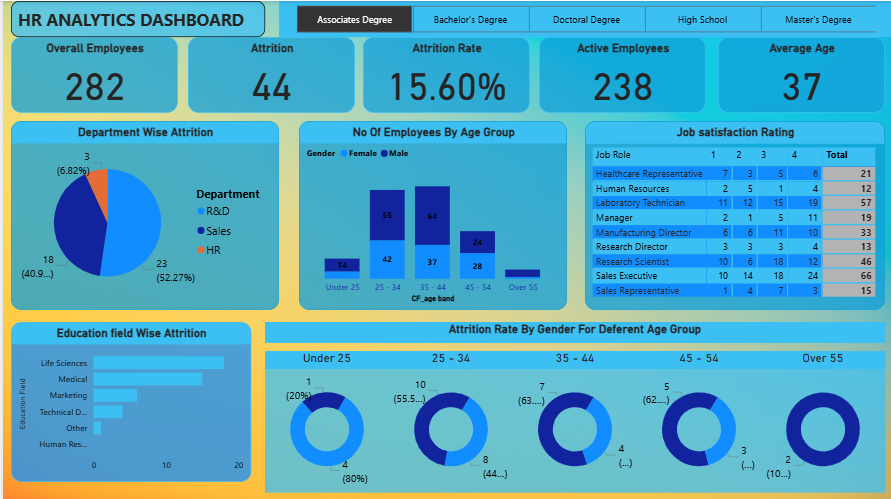

## 🌟 HR Analytics Dashboard

📌 Overview

  The HR Analytics Dashboard is an interactive Power BI project designed to provide actionable insights into workforce management.
  It helps HR professionals and business leaders monitor employee trends, attrition, and demographics for data-driven decision-making.
  
🎯 Objectives

  📊 Track employee headcount and workforce trends
  
  📉 Analyze attrition rates across departments
  
  👥 Understand gender & age group distributions
  
  🏢 Compare job roles and workforce structure
  
  🎯 Support strategic HR decisions with insights

🚀 Key Features

  ✅ Clean & interactive Power BI dashboard
  
  ✅ Department-wise attrition & workforce insights
  
  ✅ Workforce diversity (gender, age, job role)
  
  ✅ Dynamic filters & slicers for deep exploration
  
  ✅ Professional design with custom background

📂 Repository Structure
  File	Description
  HR Analytics.pbix	Power BI dashboard file
  HR Data.xlsx	Employee dataset used for analysis
  Hr Report Background.jpg	Custom background image for dashboard

🛠️ Tools & Technologies

  Power BI Desktop – for dashboard creation
  
  Microsoft Excel – data source
  
  Data Visualization & Analytics – insights & reporting

📸 Dashboard Preview

📈 Use Cases

  👔 HR Teams → Monitor retention & attrition trends
  
  📊 Business Leaders → Track workforce distribution
  
  🧑‍💼 Talent Management → Identify risk areas & retention strategies

⚡ Getting Started

  Download or clone this repository
  
  Open HR Analytics.pbix in Power BI Desktop
  
  Ensure HR Data.xlsx is in the same folder (or reconnect the data source)
  
  Explore the dashboard with interactive filters & slicers
